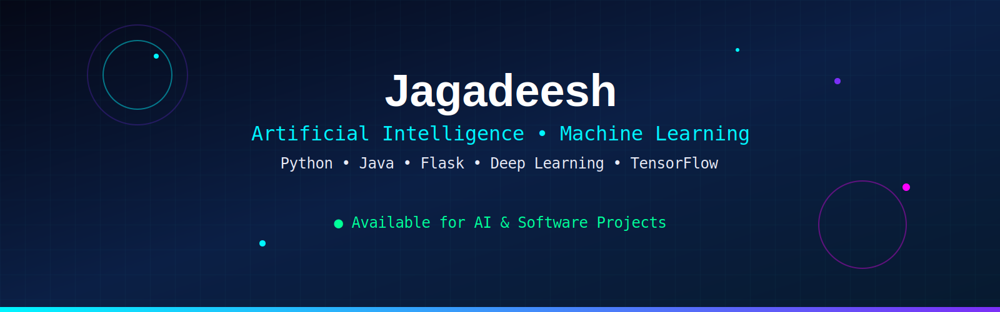
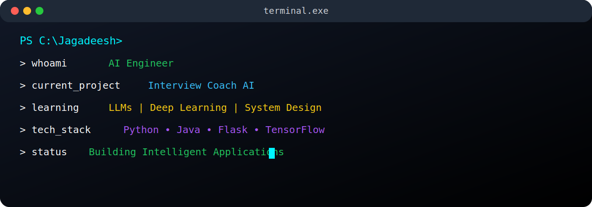
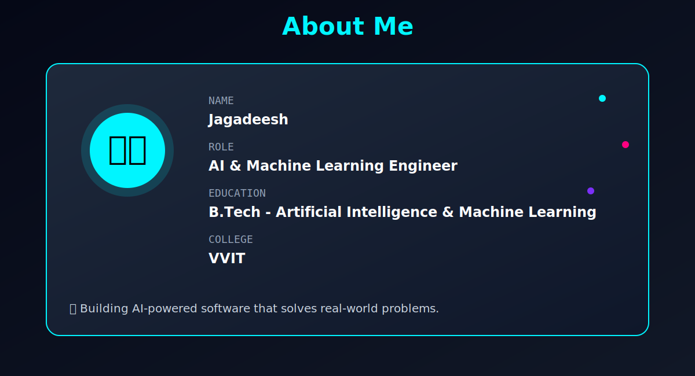
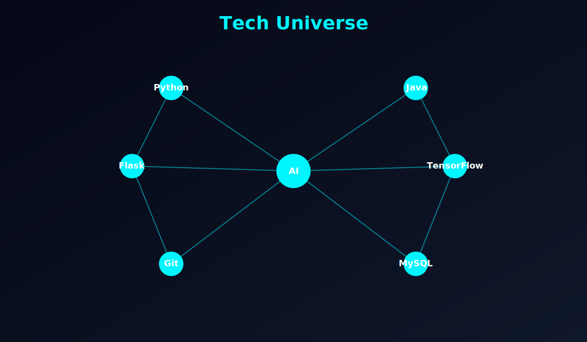
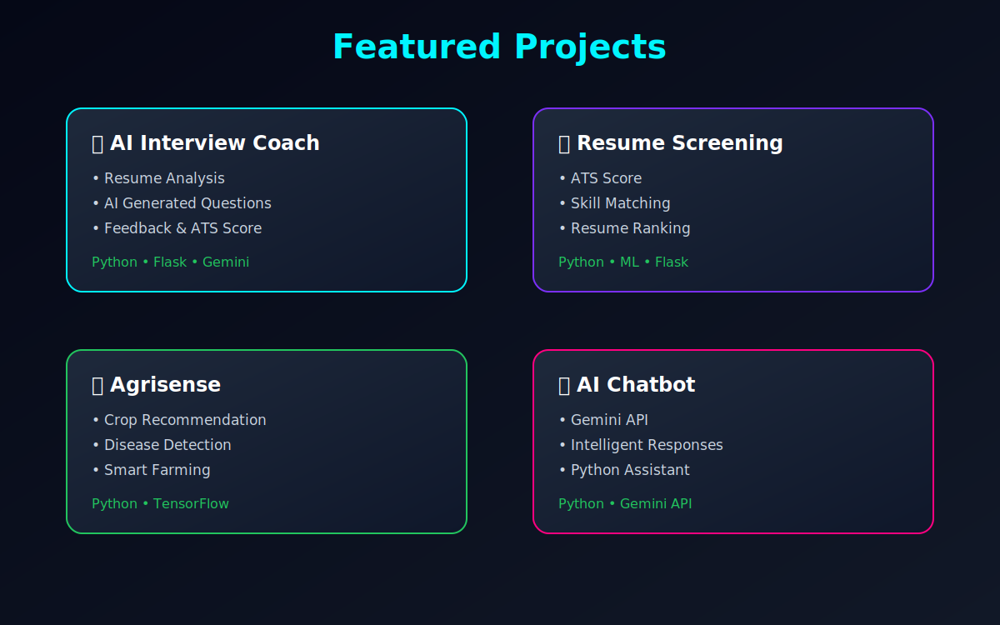
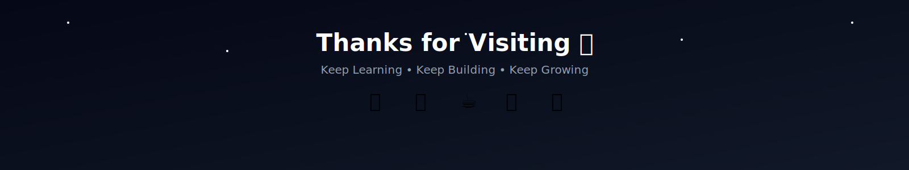

<!-- ===================================================== -->
<!--                 JAGADEESH GITHUB PROFILE               -->
<!-- ===================================================== -->

<p align="center">



</p>

<h1 align="center">

Hi 👋 I'm <span style="color:#00F5FF;">Jagadeesh</span>

</h1>

<h3 align="center">

🚀 Artificial Intelligence & Machine Learning Engineer

</h3>

<p align="center">


</p>

---

# ⚡ AI Dashboard

<table>

<tr>

<td width="50%">



</td>

<td width="50%">

## 👨‍💻 Profile

```yaml
Name: Jagadeesh

Role:
Artificial Intelligence Engineer

Education:
B.Tech AIML

College:
VVIT

Location:
India

Languages:
Python
Java

Current Focus:
Artificial Intelligence
Machine Learning
Deep Learning
LLMs
System Design

Status:
Building Intelligent Applications 🚀
```

</td>

</tr>

</table>

---

# 🌌 About Me

<p align="center">



</p>

---

# 🚀 Current Mission

```diff
+ Build AI Projects

+ Master Machine Learning

+ Learn Deep Learning

+ Solve 500+ DSA Problems

+ Learn LLM Development

+ Become an AI Engineer

+ Contribute to Open Source
```

---

# 🌍 Connect With Me

<p align="center">

<a href="mailto:jagadeeshthungala@gmail.com">


</a>

<a href="https://github.com/Jagadeesh-2005">


</a>

<a href="https://www.linkedin.com/in/tungala-jagadeesh-0216b1336/">


</a>

<a href="https://www.instagram.com/__mr___innocent__18/">


</a>

</p>

---

<p align="center">


</p>

---

# 🛰 Developer Information

| 💡 Information | 🚀 Details |
|---------------|-----------|
| 🎓 Degree | B.Tech AIML |
| 🏫 College | VVIT |
| 💻 Languages | Python, Java |
| 🤖 Specialization | Artificial Intelligence |
| 🌱 Learning | Deep Learning, LLMs |
| 🔥 Interests | AI, ML, Full Stack, DSA |
| 🎯 Goal | AI Engineer at Product-Based Company |

---
<!-- ===================================================== -->
<!--                 TECH UNIVERSE                         -->
<!-- ===================================================== -->

# 🧠 Tech Universe

<p align="center">



</p>

---

# 💻 Tech Stack

<p align="center">


</p>

---

# ⚙️ Development Environment

<table align="center">

<tr>

<td align="center">

💻 IDE

<br><br>

VS Code

</td>

<td align="center">

🤖 AI

<br><br>

Machine Learning

</td>

<td align="center">

☕ Backend

<br><br>

Flask

</td>

<td align="center">

🗄 Database

<br><br>

MySQL

</td>

</tr>

</table>

---

# 📈 Skill Progress

| Technology | Progress |
|------------|----------|
| 🐍 Python | ████████████████████ 95% |
| ☕ Java | ██████████████████ 90% |
| 🤖 Machine Learning | █████████████████ 85% |
| 🧠 Deep Learning | ████████████ 65% |
| 🌐 HTML/CSS | ██████████████████ 90% |
| ⚛ Flask | █████████████████ 85% |
| 📚 DSA | ███████████████ 80% |
| 🏗 System Design | ████████ 40% |

---

# 🚀 Featured Projects

<p align="center">



</p>

---

## 🤖 AI Interview Coach

> AI-powered interview platform

**Features**

- Resume Analysis
- ATS Score Prediction
- AI Interview Questions
- AI Answer Evaluation
- Performance Report

**Tech**

Python • Flask • Gemini API

---

## 📄 Smart Resume Screening

> ATS Resume Analysis

Features

- Resume Ranking

- Skill Matching

- Recommendation Engine

- Flask Dashboard

---

## 🌾 Agrisense

> Smart Farming Assistant

Features

- Crop Recommendation

- Disease Detection

- TensorFlow Model

- Smart Prediction

---

## 💬 AI Chatbot

Features

- Gemini API

- Intelligent Responses

- Chat History

- Modern UI

---

# 📈 2026 Learning Roadmap

<p align="center">



</p>

---

# 🎯 Current Learning

```text
██████████████████████

Artificial Intelligence

███████████████████

Machine Learning

██████████████

Deep Learning

██████████

System Design

████████████

Large Language Models

███████████

Open Source

██████████████████████
```

---

# 🚀 2026 Goals

✅ Build 10 AI Projects

✅ Solve 500+ DSA Problems

✅ Master Deep Learning

✅ Learn Large Language Models

✅ Build SaaS Applications

✅ Open Source Contributions

✅ Product-Based Company

---

# 💡 Favorite Quote

> "Great software isn't built by writing more code. It's built by solving meaningful problems."

---
<!-- ===================================================== -->
<!--                GITHUB ANALYTICS                       -->
<!-- ===================================================== -->

# 📊 GitHub Analytics

<p align="center">


</p>

---

<p align="center">


</p>

---

# 📈 Contribution Activity

<p align="center">


</p>

---

# 📊 Profile Summary

<p align="center">
  
</p>

<p align="center">


</p>

<p align="center">


</p>

---

# ⚡ Coding Activity

```text
🐍 Python            ████████████████████ 95%

☕ Java              ██████████████████   90%

🤖 Machine Learning  ████████████████     85%

⚛ Flask             ███████████████      82%

📚 DSA               █████████████        80%

🧠 Deep Learning     ██████████           65%

🏗 System Design     ██████               45%

☁ Cloud             ███                  25%
```

---

# 📅 Weekly Development Breakdown

```text
Monday      ██████████

Tuesday     ██████████████

Wednesday   ███████████

Thursday    ███████████████

Friday      ████████████

Saturday    █████████████████

Sunday      ███████
```

---

# 🌍 Open Source Journey

```diff
+ AI Projects

+ GitHub Portfolio

+ Machine Learning

+ Resume Screening

+ Interview Coach

+ DSA Repository

+ Open Source Contributions

+ Continuous Learning
```

---

<p align="center">


</p>

---
<!-- ===================================================== -->
<!--                ACHIEVEMENTS                           -->
<!-- ===================================================== -->


# 🎯 2026 Mission

<div align="center">

| Goal | Status |
|------|--------|
| 🤖 Master Artificial Intelligence | 🟢 In Progress |
| 🧠 Learn Deep Learning | 🟢 In Progress |
| 💬 Learn Large Language Models | 🟢 In Progress |
| 📚 Solve 500+ DSA Problems | 🟡 Ongoing |
| 🚀 Build 10 AI Projects | 🟡 Ongoing |
| 🌐 Contribute to Open Source | 🟢 Active |
| ☁ Learn Cloud Computing | 🔵 Planned |
| 💼 Crack Product-Based Company | 🎯 Target |

</div>

---

# 📊 Developer Journey

```text
2023
│
├── Started Programming
│
2024
│
├── Java
├── Python
├── Web Development
│
2025
│
├── Machine Learning
├── Deep Learning
├── DSA
│
2026
│
├── AI Interview Coach
├── Resume Screening
├── Agrisense
├── AI Chatbot
├── Advanced GitHub Portfolio
│
2027
│
└── AI Engineer 🚀
```

---

# 💬 Daily Developer Quote

<p align="center">


</p>

---

# 🎮 Fun Facts

```yaml
while(alive){

    Eat();

    Code();

    Learn();

    Build();

    Repeat();

}
```

---

# 💻 Current Tech Radar

```text
██████████████████████

Python

████████████████████

Java

██████████████████

Machine Learning

███████████████

Flask

████████████

Deep Learning

██████████

LLMs

████████

System Design

█████

Cloud

```

---

# ☕ Support My Work

If you like my projects,

⭐ Star my repositories

🍴 Fork them

🤝 Connect with me

🚀 Follow my journey

---

<p align="center">



</p>

---

<h2 align="center">

⭐ Thanks for Visiting ⭐

</h2>

<p align="center">


</p>
